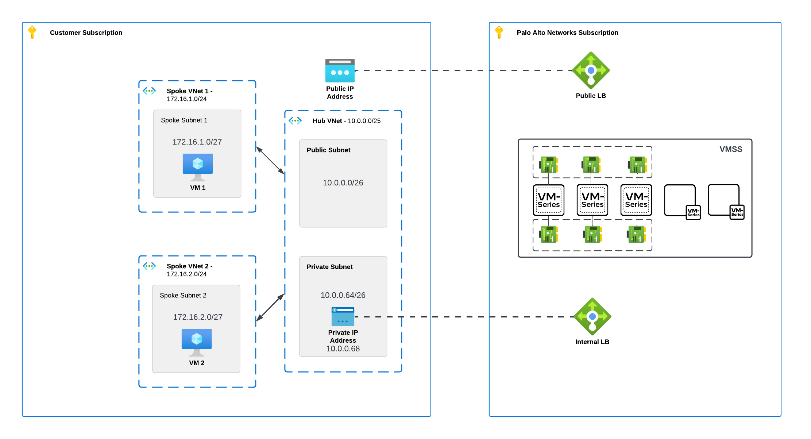
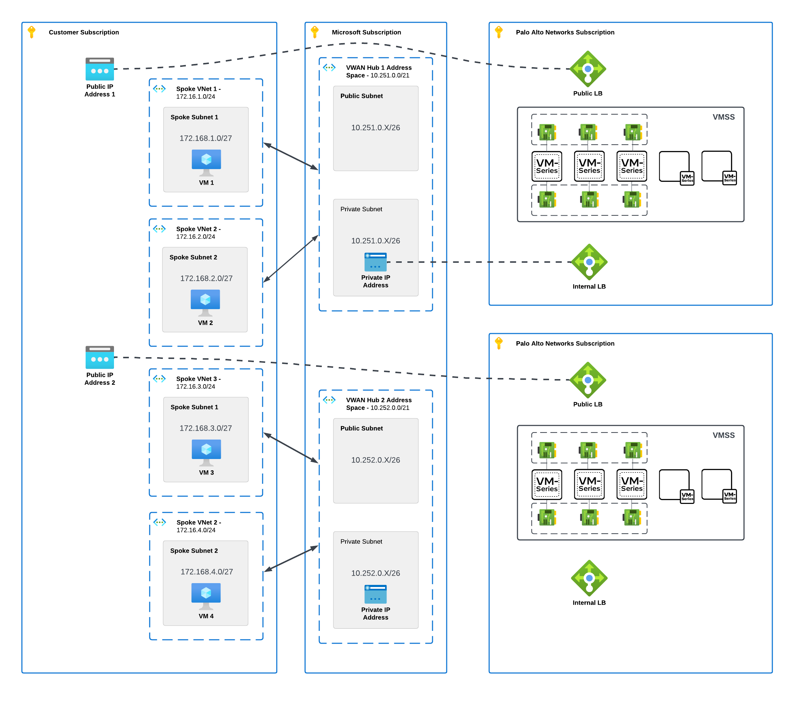
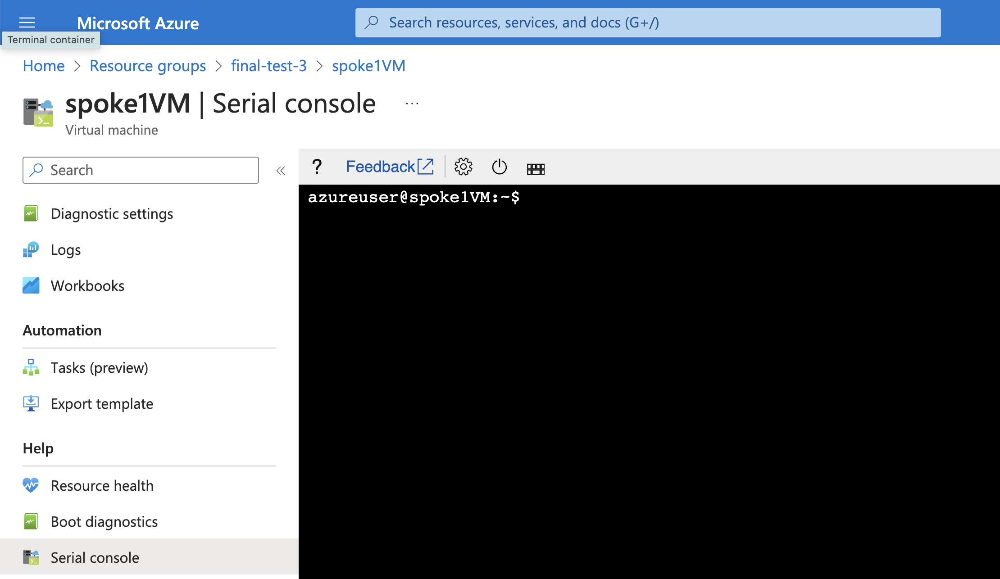

# cloudngfw-azure-lab

#### The below scripts deploy a basic test setup for Cloud NGFW for Azure

- vnet.sh - Hub and Spoke VNet deployment with spoke VMs. Single region
- vwan.sh - Virtual WAN deployment with spoke VMs. Multi region

### Hub and Spoke Vnet


### Virtual WAN Hub


### Prerequisites
- Terminal or CLI program
- Azure CLI palo-alto-networks extension for the Azure CLI (version 2.51.0 or higher).


Install by running any palo-alto commands:

```azurecli
azureuser@test-cli-vm:~$ az palo-alto cloudngfw list
'palo-alto' is misspelled or not recognized by the system.

Examples from AI knowledge base:
https://aka.ms/cli_ref

Read more about the command in reference docs
azureuser@test-cli-vm:~$ az palo-alto cloudngfw firewall list
The command requires the extension palo-alto-networks. Do you want to install it now? The command will continue to run after the extension is installed. (Y/n):
```

or install explicitly:
```azurecli

az extension add --name palo-alto-networks
```

#### Usage
```bash
#./vnet.sh <Resource Group> <Region>
#./vwan.sh <Resource Group> <Region 1> <Region 2>
```

#### Accessing spoke VMs

Use Azure Portal to access VM's Serial Console.

User credentials:
- azureuser/< password entered during the script run >

